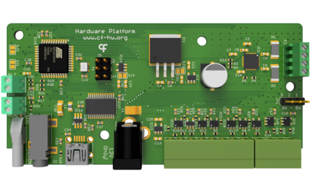

## Harp Syringe Pump
This is a repository for the Harp Syringe Pump. The Harp Syringe Pump is a device that can be used to control the flow of liquid through a syringe by driving a stepper motor.

### Key Features ###

* Low and High-level interface control of the stepper motor
* General digital inputs configurable to trigger hardware events
* Digital outputs configurable to report hardware events
* Includes on-board stepper-motor driver
* Included mechanical designs and assembly instructions

### Connectivity ###

* 1x clock sync input (CLKIN) [stereo jack]
* 1x USB (for computer) [USB type B]
* 1x 12V supply [barrel connector jack]
* General purpose I/O (5V) [screw terminal]

## Interface ##

The interface with the Harp Behavior can be done through [Bonsai](https://bonsai-rx.org/) or a dedicated GUI (Graphical User Interface).

## Licensing ##

Each subdirectory will contain a license or, possibly, a set of licenses if it involves both hardware and software.